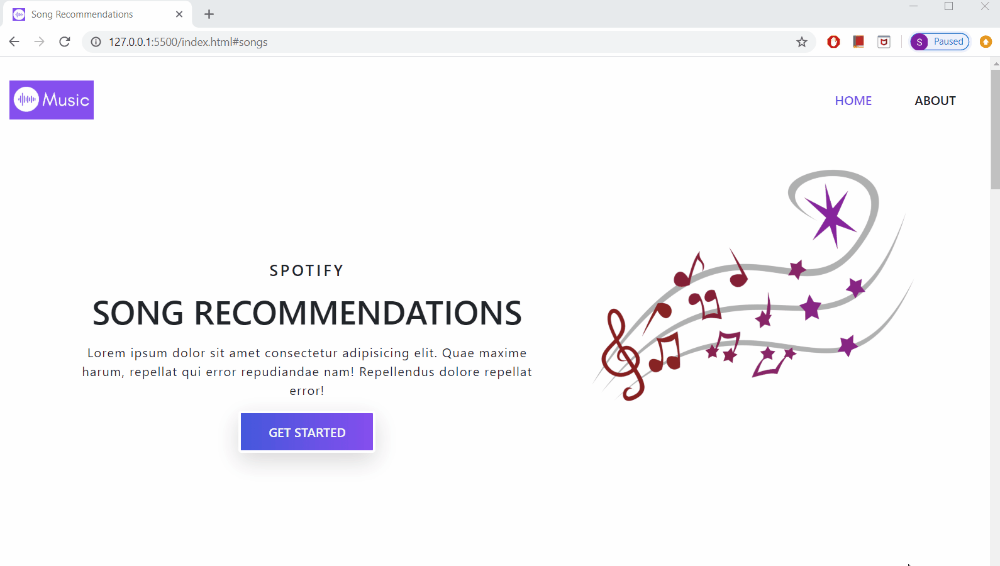

# SpotiMusic
A single-page mobile-responsive website that shuffles songs based on different moods (for example: happy, sad, silly, romantic, melancholy)

# Technologies 
- HTML5
- CSS3
- JavaScript

# Dependencies
- Bootstrap 4+
- Jquery 3.4+